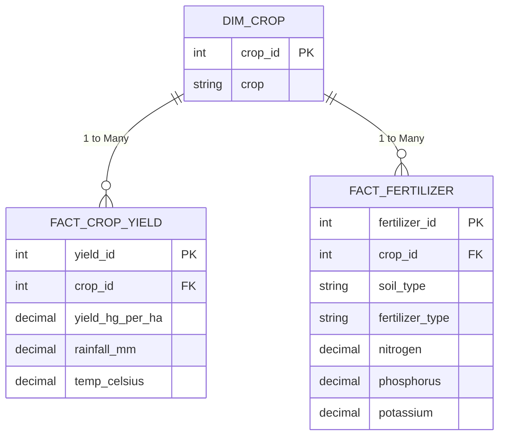

# Agri_Intelligence_Analytics_Platform
End-to-End Data Pipeline, Relational Star Schema, and Executive Reporting Engine 

## Executive Summary

This project transforms disparate, unstructured agricultural JSON datasets into a production-ready MySQL relational database. By architecting a Star schema and developing isolated aggregate pipeline views, the platform standardizes metric across crop yields, climate factors, and fertilizer consumption. The final engine eliminates data duplication and surfaces clean insights for agricultural stakeholders.

## Business Problem and Objectives

Modern precision agriculture relies on fragmented data streams such as global harvest benchmark, applied nutrient logs, and localized climate metrics. Integrating these sources manually creates reporting inconsistencies and analytical risks.

* **Schema Standardization:** Stage, clean, and normalize raw JSON imports into structured dimension and fact tables.
* **Data Integrity and Quality:** Diagnose missing features, unrecoverable values, and schema mismatches across datasets.
* **Optimized Aggregation:** Construct a robust reporting layer that prevents join-multiplication (fan-out effect) when querying independent fact tables.
* **Executive Reporting:** Deliver a unified view (vw_executive_crop_summary) summarizing historical yields, climate demands, and fertilizer requirements.

## Architecture and Data Modeling

The platform transitions flat JSON inputs into a normalized Star schema optimized for analytical queries: 

## Data Quality and Engineering Challenges
* **Feature Elimination Due to Sparsity:** During initial data profiling, the soil and crop_disease staging tables exhibited unrecoverable NaN distributions and sparse coverage. To maintain schema integrity, these dimensions were strategically excluded from the core relational model.
* **Disparate Dataset Intersection Gaps:** Cross-auditing the global yield dataset against localized crop metrics revealed a limited exact-match intersection (maize). Naming discrepancies (e.g., 'rice, paddy' vs 'rice') were resolved using string normalization functions (LOWER, TRIM, REPLACE) to align dimensions seamlessly.
* **Resolving Join Fan-Out (Many-to-Many Multipliers):** Joining fact_crop_yield directly to fact_fertilizer caused record multiplication due to shared crop_id keys without transactional foreign keys.
> **Solution:** Applied Common Table Expressions (CTEs) to pre-aggregate metrics at the crop_id level inside each fact table before allying LEFT JOIN operations from dim_crop. This guaranteed 1:1 metric alignment without inflating yield calculations.

## Key Business Insights

* **High-Mass Crop Drivers:** Tubers (potatoes, cassava, sweet potatoes) dominate mass output, yielding over 110,000hg/ha in moderate-to-warm climates (19°C - 24°C).
* **Nutrient Optimization Patterns:** High-nitrogen fertilizer applications primarily utilize Urea (39-42 N units) across loamy and black soils for cereals and oilseeds. Blend types like 28-28 serve as secondary input across legumes and paddy crops.
* **Climate Sensitivity:** Plantains and yams demonstrate the highest water dependency, requiring annual rainfall exceeding 1,600 mm/year.

## Technical Stack
* **Database Management System:** MySQL Workbench / MySQL 8.0
* **Language and Features:** SQL(DDL, DML, CTEs, Window Aggregations, Views, Inner/Outer Joins, String Normalization)
* **Data Source:** Multi-source JSON files (Yield, Climate, Fertilizer)

  ##
